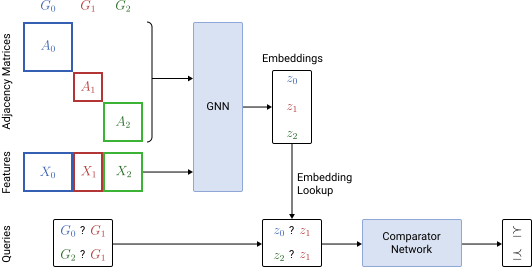

# RankGNN Tensorflow Implementation

This repository contains a Tensorflow implementation of the RankGNN model family described in [Ranking Structured Objects with Graph Neural Networks (Damke and Hüllermeier, Discovery Science 2021)](https://arxiv.org/abs/2104.08869).

**Abstract:**
Graph neural networks (GNNs) have been successfully applied in many structured data domains, with applications ranging from molecular property prediction to the analysis of social networks.
Motivated by the broad applicability of GNNs, we propose the family of so-called RankGNNs, a combination of neural Learning to Rank (LtR) methods and GNNs.
RankGNNs are trained with a set of pair-wise preferences between graphs, suggesting that one of them is preferred over the other.
One practical application of this problem is drug screening, where an expert wants to find the most promising molecules in a large collection of drug candidates.
We empirically demonstrate that our proposed pair-wise RankGNN approach either significantly outperforms or at least matches the ranking performance of the naive point-wise baseline approach, in which the LtR problem is solved via GNN-based graph regression.

The raw experimental results reported in the paper can be found in the [results](./results) directory.

The easiest way to run the code yourself is via the provided Docker environment; to build and run the container, execute `./run.sh rebuild`.
With the container running, the experiments (hyperparameter tuning and repeated training of the various dataset/model combinations) can be started with `./evaluate_datasets.sh`; by default all combinations are evaluated, this can be restricted via CLI arguments (see `./evaluate_datasets.sh --help`).
